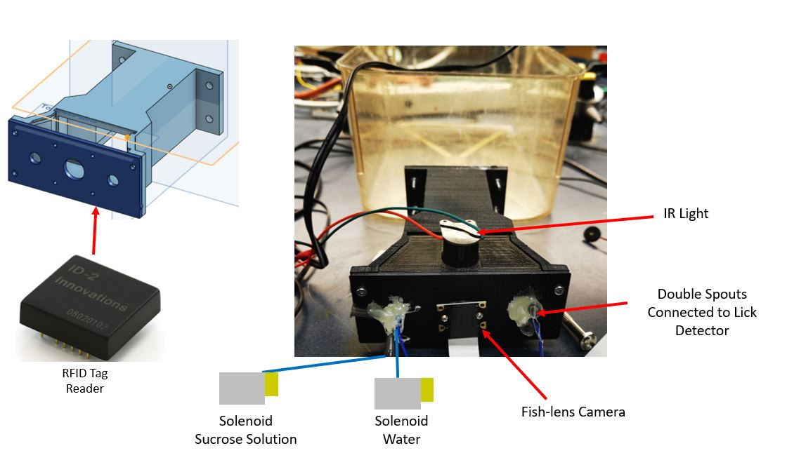

# Home-cage Sucrose Preference Test
A scipt to run a chronic automated sucrose preference test of mice in home cage. The script is ran on a raspberry-pi with internet connection. A sucrose preference tunnel is attached to a rodent cage. The tunnel consists of a RFID reader for mouse identification, two double spouts for liquid dispension, capacitive touch sensor for lick detection, selenoids for reward delivery, IR light, and a fish-lens camera for behavior monitoring. An updated hardware list and setup instructions will be uploaded shortly. 
## MySql Database for Data Storage
- All behaviroal data (entries, exits, spout licked, type of reward dispensed) are logged on to the raspberry-pi MySql database. 
- The database is also hosted  by Apache HTTP Sever(version 2.4.43) and can be accessed through the internet
- Subsequent analytical scripts will also be uploaded
## RFID Identification
- A ID-20LA RFID tag reader will be at the beginning of the SPT tunnel to identify each mouse
## Spout choice At the of the Sucrose Preference Test Tunnel
- At the end of the tunnel there are two double spouts on each side
- the mouse and the spouts are spearted by a customed cut acrylic plastic (one hole corresponds to one double spout)
- A reward water/sucrose water is dispensed for every n links at each double spout. The n number of licks can be set accordingly
- Every 24 hour, the side which dispenses water/sucrose is swaped for the specific mouse
###Design and Layout of the Sucrose Preference Tunnel

### Mouse Licking Spouts For Rewards In The Sucrose Preference Test Tunnel
Mouse Licking Right Spout             |  Mouse Licking Left Spout
:-------------------------:|:-------------------------:
 | 
